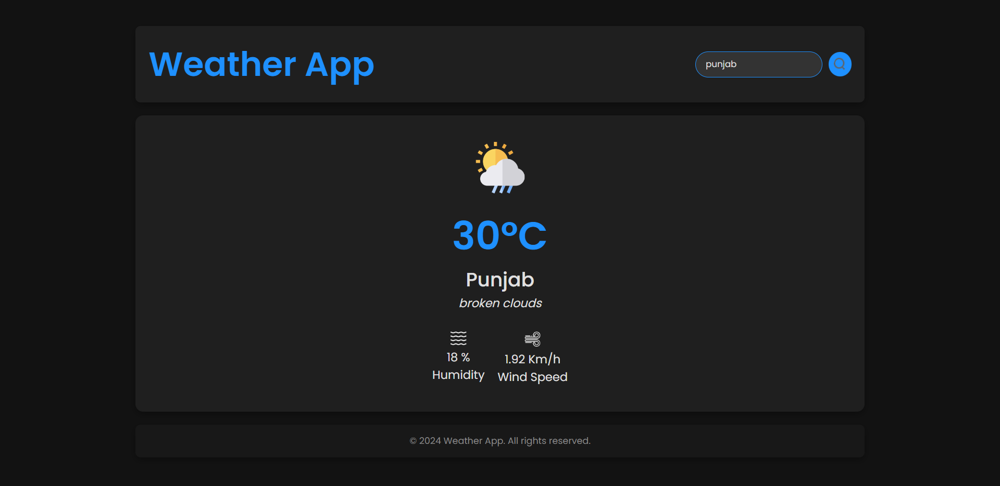

# Weather App

This is a **Weather App** built using **React** with **Vite** as the build tool. It leverages the **OpenWeather API** to fetch real-time weather data based on user input for cities around the world.

## Demo

Check out the live demo of the Weather App [here](https://weather-app-pw35.onrender.com/).

## Features

- **Real-Time Weather Data**: Displays current weather, temperature, humidity, and other details.
- **Search by City**: Input any city name to get accurate, up-to-date weather information.
- **Responsive Design**: Optimized for both desktop and mobile devices.
- **User-Friendly UI**: Simple and intuitive interface for ease of use.

## Technologies Used

- **React** with **Vite** for fast and efficient front-end development
- **OpenWeather API** for fetching weather data
- **CSS** for styling and responsive design

## Getting Started

1. Clone the repository.
2. Set up an API key for the OpenWeather API and add it to your environment configuration.

## Usage

Enter a city name in the search bar to get current weather information for that location. The app will display temperature, humidity, weather conditions, and other relevant information.

## Screenshot

## License

This project is open-source and available under the MIT License.

---

Thank you for checking out the Weather App! Feel free to contribute, report issues, or reach out if you have any questions.
